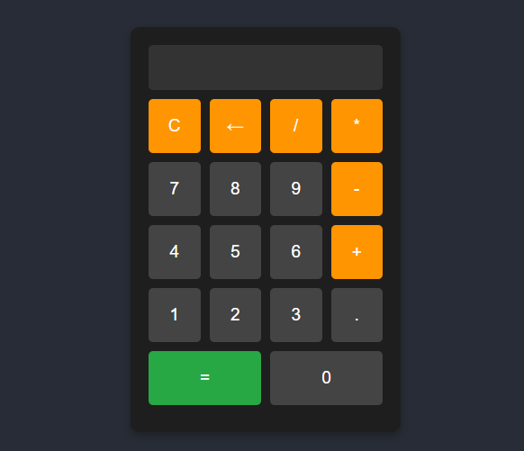

# Matheus Correia - Calculadora Online

Estruturei a calculadora com HTML5, estilizei com CSS3, desing simples porem charmoso, e usei JavaScript para ter uma experiência do usuário com botões interativos, e apesar de ser uma calculadora simples online, usei codigos seguros.

## Visão Geral

### Captura de Tela

### Links

- URL do Site Ativo: [aqui](https://matheuscorreiadev.github.io/online-calculator)

## Meu Processo

### Construído com

- HTML5 
- CSS3
- JavaScript
